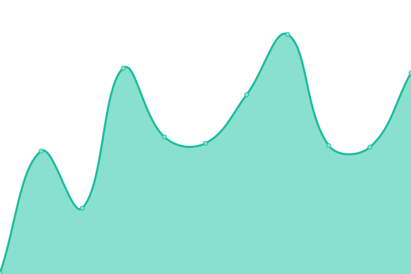
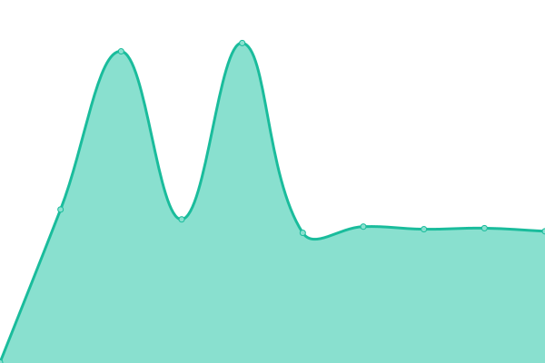
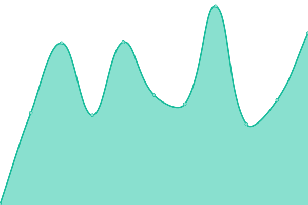
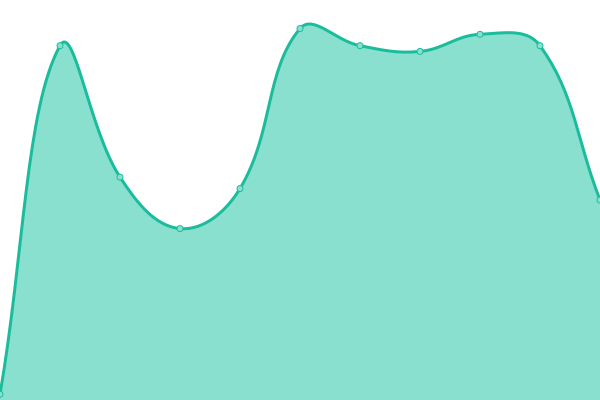

# 🩺📈 Stethoscope Status

This is our status page, powered by [Upptime](https://upptime.js.org).

Live status: <!--live status--> **🟨 Partial outage**

## [📈 Status](https://stethoscope-js.github.io/status/)

_This section is updated automatically when the status of any site changes._

<!--start: status pages-->

| URL                                             | Status  | History                                                                                                      | Response Time                                                                         | Uptime                                                                                                                                                            |
| ----------------------------------------------- | ------- | ------------------------------------------------------------------------------------------------------------ | ------------------------------------------------------------------------------------- | ----------------------------------------------------------------------------------------------------------------------------------------------------------------- |
| [Google](https://www.google.com)                | 🟩 Up   | [google.yml](https://github.com/stethoscope-js/status/commits/master/history/google.yml)                     |  79ms            |            |
| [Wikipedia](https://en.wikipedia.org)           | 🟩 Up   | [wikipedia.yml](https://github.com/stethoscope-js/status/commits/master/history/wikipedia.yml)               |  168ms        |         |
| [Internet Archive](https://archive.org)         | 🟩 Up   | [internet-archive.yml](https://github.com/stethoscope-js/status/commits/master/history/internet-archive.yml) |  499ms |  |
| [Hacker News](https://news.ycombinator.com)     | 🟩 Up   | [hacker-news.yml](https://github.com/stethoscope-js/status/commits/master/history/hacker-news.yml)           |  335ms      |       |
| [Broken Site](https://thissitedoesnotexist.com) | 🟥 Down | [broken-site.yml](https://github.com/stethoscope-js/status/commits/master/history/broken-site.yml)           |  0ms        |         |
| Secret Site                                     | 🟩 Up   | [secret-site.yml](https://github.com/stethoscope-js/status/commits/master/history/secret-site.yml)           |  43ms       |       |

<!--end: status pages-->

## 📄 License

- Code: [MIT](./LICENSE) © [Koj](https://koj.co)
- Data in the `./history` directory: [Open Database License](https://opendatacommons.org/licenses/odbl/1-0/)
