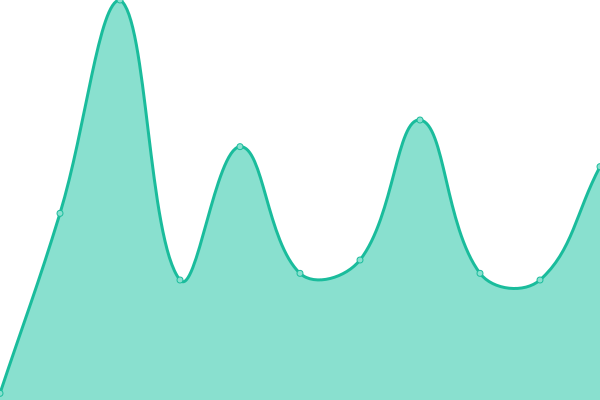

# 🩺📈 Stethoscope Status

This is our status page, powered by [Upptime](https://upptime.js.org).

With [Upptime](https://upptime.js.org), you can get your own unlimited and free uptime monitor and status page, powered entirely by a GitHub repository. We use [Issues](https://github.com/stethoscope-js/status/issues) as incident reports, [Actions](https://github.com/stethoscope-js/status/actions) as uptime monitors, and [Pages](https://stethoscope-js.github.io/status/) for the status page.

Live status: <!--live status--> **🟥 Complete outage**

## [📈 Status](https://stethoscope-js.github.io/status/)

_This section is updated automatically when the status of any site changes._

<!--start: status pages-->
<!-- This summary is generated by Upptime (https://github.com/upptime/upptime) -->
<!-- Do not edit this manually, your changes will be overwritten -->

| URL                                                                                                                                      | Status  | History                                                                                                        | Response Time                                                                         | Uptime                                                                                                                                                                                                                                         |
| ---------------------------------------------------------------------------------------------------------------------------------------- | ------- | -------------------------------------------------------------------------------------------------------------- | ------------------------------------------------------------------------------------- | ---------------------------------------------------------------------------------------------------------------------------------------------------------------------------------------------------------------------------------------------- |
| [Stethoscope Docs](https://stethoscope.js.org)                                                                                           | 🟥 Down | [stethoscope-docs.yml](https://github.com/stethoscope-js/status/commits/master/history/stethoscope-docs.yml)   |  168ms |    |
| [Stethoscope Embed](https://stethoscope.js.org/embed/?repo=AnandChowdhary%2Flife&api=rescuetime-time-tracking&latest=top-overview.weeks) | 🟥 Down | [stethoscope-embed.yml](https://github.com/stethoscope-js/status/commits/master/history/stethoscope-embed.yml) |  58ms |  |

<!--end: status pages-->

## 📄 License

- Code: [MIT](./LICENSE) © [Stethoscope](https://stethoscope.js.org)
- Data in the `./history` directory: [Open Database License](https://opendatacommons.org/licenses/odbl/1-0/)
