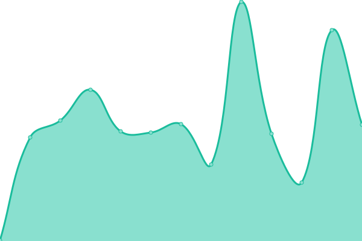
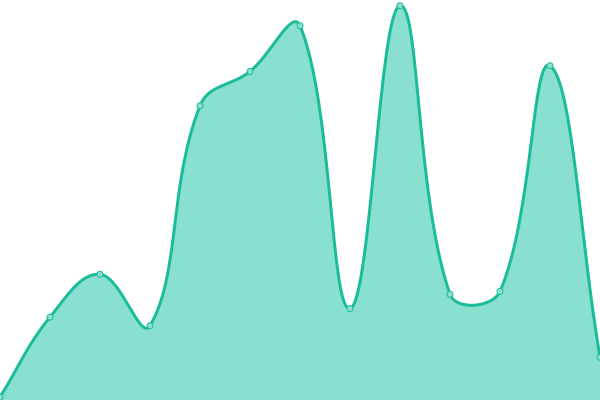

# 🩺📈 Stethoscope Status

This is our status page, powered by [Upptime](https://upptime.js.org).

With [Upptime](https://upptime.js.org), you can get your own unlimited and free uptime monitor and status page, powered entirely by a GitHub repository. We use [Issues](https://github.com/stethoscope-js/status/issues) as incident reports, [Actions](https://github.com/stethoscope-js/status/actions) as uptime monitors, and [Pages](https://stethoscope-js.github.io/status/) for the status page.

Live status: <!--live status--> **🟥 Complete outage**

## [📈 Status](https://stethoscope-js.github.io/status/)

_This section is updated automatically when the status of any site changes._

<!--start: status pages-->
<!-- This summary is generated by Upptime (https://github.com/upptime/upptime) -->
<!-- Do not edit this manually, your changes will be overwritten -->
<!-- prettier-ignore -->
| URL | Status | History | Response Time | Uptime |
| --- | ------ | ------- | ------------- | ------ |
|  [Stethoscope Docs](https://stethoscope.js.org) | 🟥 Down | [stethoscope-docs.yml](https://github.com/stethoscope-js/status/commits/HEAD/history/stethoscope-docs.yml) | 

 230ms
     
 | 

<a href="https://stethoscope-js.github.io/status/history/stethoscope-docs">99.10%</a>
    

|  [Stethoscope Embed](https://stethoscope.js.org/embed/?repo=AnandChowdhary%2Flife&api=rescuetime-time-tracking&latest=top-overview.weeks) | 🟥 Down | [stethoscope-embed.yml](https://github.com/stethoscope-js/status/commits/HEAD/history/stethoscope-embed.yml) | 

 54ms
     
 | 

<a href="https://stethoscope-js.github.io/status/history/stethoscope-embed">99.09%</a>
    

<!--end: status pages-->

## 📄 License

- Code: [MIT](./LICENSE) © [Stethoscope](https://stethoscope.js.org)
- Data in the `./history` directory: [Open Database License](https://opendatacommons.org/licenses/odbl/1-0/)
